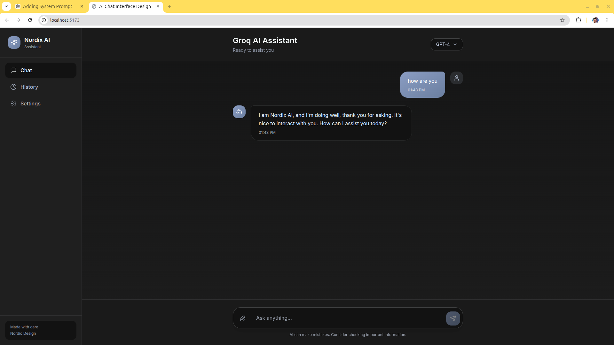

<!DOCTYPE html>
<html lang="en">

<body>

<h1>Nordic AI Chat</h1>

A modern full-stack AI chat application built using <strong>React (Vite + TypeScript)</strong> 
and <strong>FastAPI (Async)</strong>, powered by the <strong>Groq API (LLaMA3)</strong>.

    <h2>🚀 Tech Stack</h2>
    

        React + Vite
        TypeScript
        TailwindCSS
        FastAPI (Async)
        Groq API
    

    <h2>🧠 Architecture</h2>
    <pre>
Client (React)
      ↓
FastAPI API Gateway (Async)
      ↓
Groq AI Service (Async)
    </pre>
    <ul>
        <li>Frontend communicates via REST API</li>
        <li>Backend handles non-blocking async AI requests</li>
        <li>Service layer abstraction for AI provider</li>
        <li>Microservice-inspired separation of concerns</li>
    </ul>

    <h2>✨ Features</h2>
    <ul>
        <li>Modern Nordic minimalist UI</li>
        <li>Real-time AI chat interaction</li>
        <li>Async backend architecture</li>
        <li>Typing indicator simulation</li>
        <li>Secure environment variable handling</li>
        <li>Production-ready API structure</li>
    </ul>

    

    <h2>⚙ Backend Setup</h2>
    <h3>Install Dependencies</h3>
    <pre>pip install fastapi uvicorn groq python-dotenv</pre>

    Create .env
    GROQ_API_KEY=your_groq_api_key

    Run Server
    uvicorn main:app --reload --port 8000

    Backend URL: http://127.0.0.1:8000

    <h2>💻 Frontend Setup</h2>
    <h3>Install Dependencies</h3>
    <pre>npm install</pre>
    
    Start Dev Server
    npm run dev

    Frontend URL: http://localhost:5173

    <h2>🔌 API Endpoint</h2>
    <h3>POST /api/req</h3>
    
<strong>Request:</strong>

    <pre>{
  "query": "Your message here"
}</pre>

    Response:{"response": "AIgenerated      reply"}
</pre>

    <h2>🛠 Engineering Highlights</h2>
    <ul>
        <li>Fully async FastAPI backend</li>
        <li>Non-blocking Groq API integration</li>
        <li>Strong TypeScript typing</li>
        <li>Clean API gateway structure</li>
        <li>Microservice-style modular architecture</li>
        <li>Nginx reverse proxy compatible</li>
    </ul>

    <h2>📈 Future Improvements</h2>
    <ul>
        <li>Streaming token responses</li>
        <li>Database-based chat memory</li>
        <li>User authentication</li>
        <li>Model selection support</li>
        <li>Docker containerization</li>
    </ul>

    <h2>🏁 Summary</h2>
    

        Nordic AI Chat demonstrates modern full-stack engineering principles,
        combining frontend architecture, async backend design, and scalable AI API integration.
        It serves as a strong foundation for production-ready AI SaaS applications.
    

</body>
</html>
